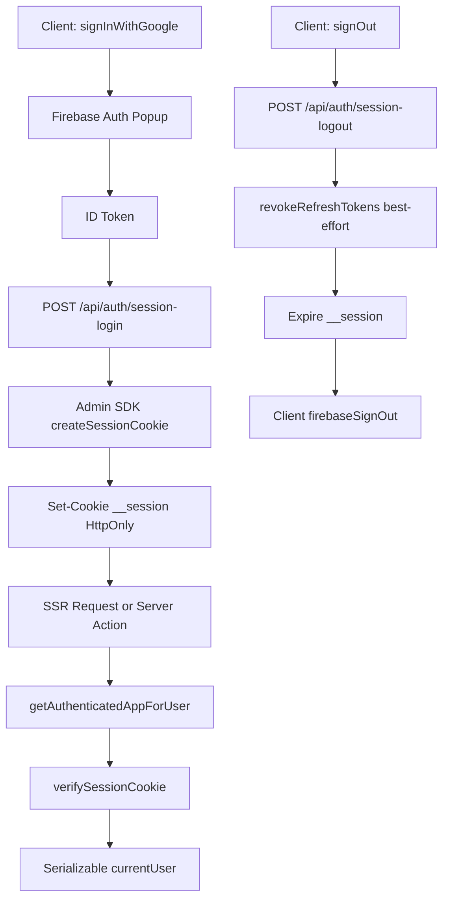

# Relatos en Ingles - Agent Playbook

## Purpose and Scope
- Stack: Next.js 16 + React 19 + TypeScript for English practice via stories and phrasal verbs.
- Data/services: MongoDB, Firebase Auth, Firestore (`phrasal_verbs`), Gemini.
- Package manager: use `pnpm` only.
- UX language: prefer Spanish copy unless the surrounding screen is clearly English-first.

## Rule Sources (Cursor and Copilot)
- Primary source: this `AGENTS.md` file.
- Cursor rules audit:
  - `.cursorrules`: not found.
  - `.cursor/rules/`: not found.
- Copilot rules audit:
  - `.github/copilot-instructions.md`: not found.
- If these files are added later, merge their rules here and prioritize the most specific scope.

## Command Reference
- Install dependencies: `pnpm install`
- Start dev server: `pnpm dev`
- Production build: `pnpm build`
- Start production server: `pnpm start`
- Lint full repo: `pnpm lint`
- Lint with autofix: `pnpm lint --fix`
- Lint one file/folder: `pnpm lint -- src/features/stories/presentation/actions.ts`
- Type-check (required because build ignores TS errors): `pnpm exec tsc --noEmit`

## Test Commands (Current State + Single-Test Guidance)
- Current state in this repo:
  - No `test` script in `package.json`.
  - No Jest/Vitest/Playwright config found.
  - No `*.test.*` or `*.spec.*` files found.
- If Vitest is added:
  - All tests: `pnpm vitest run`
  - Watch mode: `pnpm vitest`
  - Single file: `pnpm vitest run path/to/file.test.ts`
  - Single test by name: `pnpm vitest run path/to/file.test.ts -t "test name"`
- If Playwright is added:
  - Single spec: `pnpm playwright test tests/e2e/example.spec.ts`
  - Single test by name: `pnpm playwright test tests/e2e/example.spec.ts -g "name"`

## Architecture Map
- App Router root: `src/app`
- Feature route groups:
  - `src/app/(features)/stories/**`
  - `src/app/(features)/phrasal-verbs/**`
- API routes: `src/app/api/**/route.ts`
- Layered feature modules: `domain`, `application`, `infrastructure`, `presentation`
- Shared cross-feature code: `src/shared/**`

## Imports and Module Boundaries
- Prefer alias imports over deep relative paths.
- Active aliases from `tsconfig.json`:
  - `@/*`
  - `@/features/*`
  - `@/shared/*`
- Use import ordering:
  1) framework/third-party
  2) alias imports
  3) same-folder relative imports
- Use `import type` for type-only imports.
- Keep boundaries clean: avoid leaking presentation concerns into infrastructure.
- Avoid circular dependencies across layers.

## Formatting and Styling Conventions
- Follow existing file-local style; do not reformat unrelated code.
- Semicolon style is mixed across the repo:
  - many feature and server files use semicolons
  - many shadcn-style UI files omit semicolons
- Match quote style and semicolon style already used in the file you edit.
- Keep Tailwind class strings stable and intentional; avoid unnecessary class churn.
- Use `cn` from `@/shared/presentation/utils` for conditional class composition.
- Prefer minimal, purposeful comments only for non-obvious logic.

## TypeScript Expectations
- `strict: true` is enabled and must be respected.
- `allowJs: true` exists; prefer new code in TypeScript.
- Explicit return types are preferred on exported functions.
- Avoid `any`; use entities, interfaces, DTOs, and narrow unions.
- Convert Mongo `_id` values to strings before crossing server-client boundaries.
- Use schema validation (e.g., `zod`) where patterns already exist.
- Do not treat `pnpm build` as a type gate (`ignoreBuildErrors` is enabled).

## Naming Conventions
- Components: PascalCase (`EpisodeCard`).
- Hooks: `useX` (`useUserSession`).
- Use cases: verb-oriented PascalCase files (`GetStories.usecase.ts`).
- Server actions: descriptive camelCase (`startChatByEpisode`).
- Types/interfaces/entities: PascalCase with domain intent.
- Constants: `UPPER_SNAKE_CASE` for true constants only.
- Keep filenames aligned with existing feature patterns.

## Next.js and React Practices
- Add `'use client'` only for hook/browser-dependent components.
- Keep server components hook-free.
- Server actions belong in feature `presentation/actions.ts` and use `'use server'`.
- Use `revalidatePath` when mutations impact cached server-rendered views.
- Handle optimistic updates with explicit rollback/error behavior.
- For query-driven screens, prefer parsing in server pages and passing typed props down.

## Authentication Architecture (Firebase)
- Current auth model uses Firebase Auth + Firebase Admin session cookies (HttpOnly) for long-lived web sessions.
- Session cookie name: `__session`.
- Session duration is configured in `src/shared/infrastructure/auth/session.ts` using `SESSION_MAX_AGE_SECONDS` (currently 7 days).

### Current Flow (Admin Session Cookie)
- Client login starts in `src/shared/infrastructure/firebase/auth.ts`:
  - `signInWithGoogle()` opens Google popup via Firebase client SDK.
  - Reads `idToken` from `credential.user.getIdToken()`.
  - Sends token to `POST /api/auth/session-login`.
- Session creation happens server-side in `src/app/api/auth/session-login/route.ts`:
  - Validates request payload.
  - Calls `createSessionCookieFromIdToken(...)` from `src/shared/infrastructure/auth/session.ts`.
  - Sets `__session` as `HttpOnly`, `SameSite=Strict`, `Secure` in production.
- Server-side auth resolution happens in `src/shared/infrastructure/firebase/serverApp.ts`:
  - Reads `__session` from request cookies.
  - Verifies with Firebase Admin (`verifySessionCookie`).
  - Maps decoded claims into a serializable `currentUser` shape used by pages/layouts.
- Client UI state sync remains in `src/features/auth/presentation/hooks/useUserSession.ts`:
  - Uses `onIdTokenChanged` for reactive UI updates.
  - No longer writes/deletes auth cookie on the client.
- Logout flow in `src/app/api/auth/session-logout/route.ts` + `src/shared/infrastructure/firebase/auth.ts`:
  - Backend clears cookie.
  - Attempts refresh-token revocation for stronger logout semantics.
  - Client signs out from Firebase SDK.

### Current Flow Diagram

### Current Flow Purpose (Step by Step)
- `A -> B`: Starts user authentication with Google through Firebase client SDK.
- `B -> C`: Receives an ID token that proves the user identity for backend exchange.
- `C -> D`: Sends the ID token to the backend so session creation happens server-side.
- `D -> E`: Exchanges short-lived ID token for a signed web session cookie.
- `E -> F`: Stores session in an HttpOnly cookie to prevent JavaScript access.
- `F -> G -> H -> I`: Resolves authenticated user on server requests by verifying cookie signature and expiration.
- `I -> J`: Maps verified claims to a safe serializable user shape for layouts and UI.
- `K -> L`: Initiates explicit logout on backend endpoint.
- `L -> M`: Revokes refresh tokens as best effort to strengthen logout across contexts.
- `M -> N`: Expires the session cookie to cut server-authenticated access immediately.
- `N -> O`: Clears Firebase client-side auth state in the browser.

### Current Model Properties
- Cookie auth is server-issued and `HttpOnly`.
- Session TTL is controlled in `SESSION_MAX_AGE_SECONDS`.
- Server trust is based on `verifySessionCookie` (Admin SDK).
- Logout clears cookie and revokes refresh tokens as best effort.

### Auth Environment Variables
- Public Firebase web config:
  - `NEXT_PUBLIC_FIREBASE_API_KEY`
  - `NEXT_PUBLIC_FIREBASE_AUTH_DOMAIN`
  - `NEXT_PUBLIC_FIREBASE_PROJECT_ID`
  - `NEXT_PUBLIC_FIREBASE_STORAGE_BUCKET`
  - `NEXT_PUBLIC_FIREBASE_MESSAGING_SENDER_ID`
  - `NEXT_PUBLIC_FIREBASE_APP_ID`
- Firebase Admin SDK credentials (server-only):
  - `FIREBASE_PROJECT_ID`
  - `FIREBASE_CLIENT_EMAIL`
  - `FIREBASE_PRIVATE_KEY` (store with escaped `\n`; code normalizes it)
- Source for Admin credentials:
  - Firebase Console -> Project settings -> Service accounts -> Generate new private key.

## Data Access Rules
- MongoDB:
  - Always call `await dbConnect()` before model operations.
  - Use model getter helpers under `src/shared/infrastructure/database/mongo/models/*`.
  - Avoid ad-hoc `mongoose.model(...)` declarations.
  - Convert string ids with `new mongoose.Types.ObjectId(...)` (or `new Types.ObjectId(...)`) for `_id` queries.
- Firestore:
  - Phrasal verbs collection name is `phrasal_verbs`.
  - Normalize taxonomy/filter values (trim/case normalization) before matching.

## Error Handling and Logging
- Validate required inputs early and return clear client errors.
- API status conventions:
  - `400` for invalid client input
  - `500` for unexpected/infrastructure errors
- Prefer consistent JSON shape: `success`, `error`, optional `details`.
- Include operational context in logs (`episodeId`, `userProgressId`, operation).
- Use `console.warn` for recoverable issues and `console.error` for failures.
- Never log credentials, tokens, or full third-party payloads.

## UX and Copy Guidelines
- Spanish-first labels, helper text, and feedback by default.
- Keep terminology consistent (`Atras`, `Siguiente`, `Practicar`, `Categoria`).
- Preserve the current visual language (brutalist borders, hard shadows, strong hierarchy).
- Ensure responsive behavior and mobile-safe spacing.

## Environment and Secrets
- Expected env vars:
  - `MONGODB_URI`
  - `GEMINI_API_KEY`
  - `NEXT_PUBLIC_FIREBASE_*`
  - `FIREBASE_PROJECT_ID`
  - `FIREBASE_CLIENT_EMAIL`
  - `FIREBASE_PRIVATE_KEY`
- Script patterns that require env loading:
  - `node --env-file=.env.local scripts/seed-episodes.mjs`
  - `node --env-file=.env.local scripts/cleanup-episodes.mjs`
  - `node --env-file=.env.local scripts/update-episode-titles.mjs`
- Never commit `.env` files or secrets.

## Quality Gates Before Merge
- Run lint: `pnpm lint`
- Run type-check: `pnpm exec tsc --noEmit`
- Build optionally for runtime smoke check: `pnpm build`
- Note: build can pass while type-check fails in this repository.

## Manual QA Checklist
- `/stories`: section counts and card grouping render correctly.
- Story chat flow: start episode, submit translation, feedback UI appears.
- Progress persistence: reload chat URL and confirm continuity.
- `/phrasal-verbs`: filtering, search, pagination, modal behavior.
- `/phrasal-verbs/practice`: supergroup -> group -> category flow and breadcrumb backtracking.
- `/phrasal-verbs/practice/session`: selected category is received and matching verbs appear.

## Quick Agent Checklist
- Use `pnpm` only.
- Preserve existing file-local formatting.
- Prefer alias imports and `import type`.
- Keep strict typing; prefer explicit exported returns.
- Validate inputs and handle errors consistently.
- Maintain Spanish-first UX unless the page is intentionally English-first.
