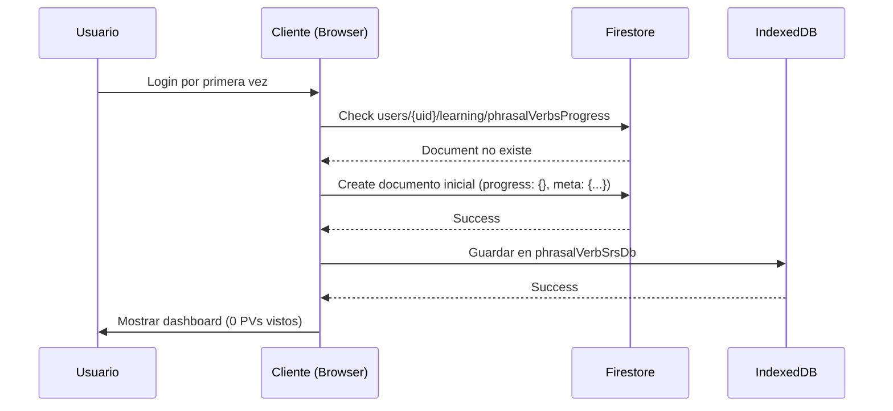
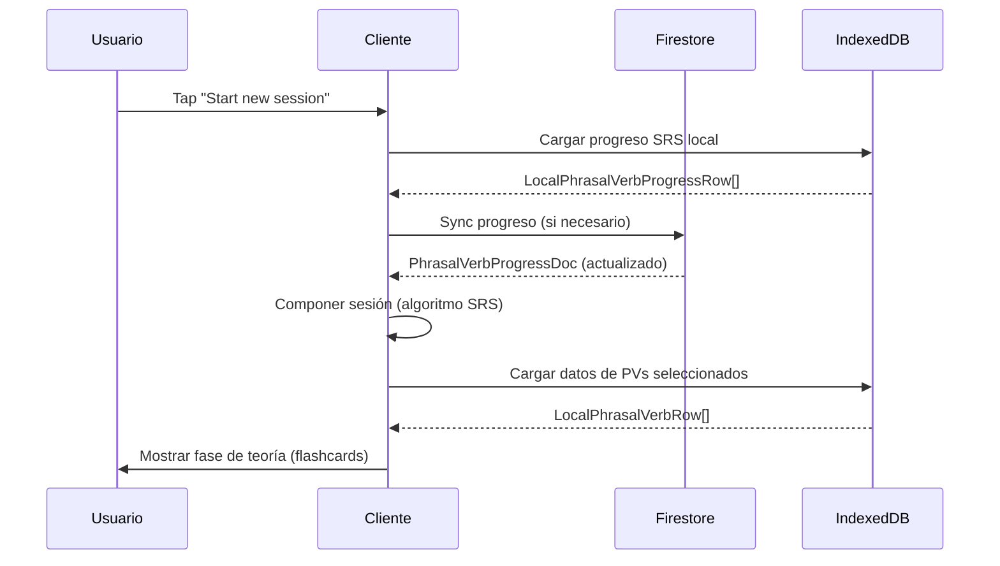
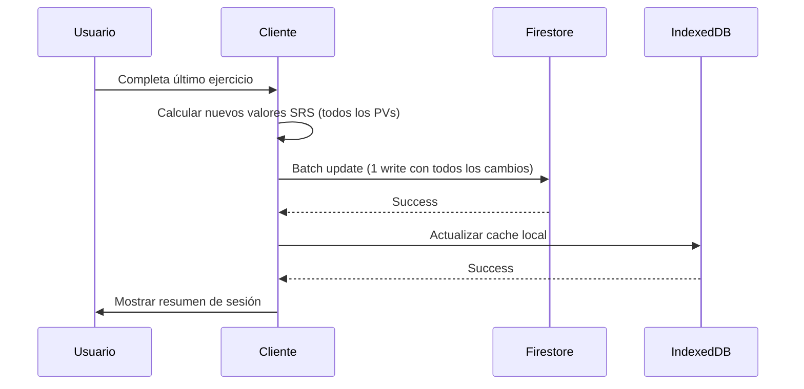

# Sistema de Repetición Espaciada (SRS) - Documento de Requerimientos Funcionales y Técnicos

**Proyecto:** Phrasal Verbs Learning App  
**Versión:** 1.0  
**Fecha:** Febrero 2026  
**Stack:** Next.js 16, React 19, TypeScript, Firebase Firestore, IndexedDB (Dexie), Framer Motion

## Tabla de Contenidos

- Visión General
- Arquitectura de Datos
- Modelo de Datos Firestore
- Modelo de Datos IndexedDB
- Flujos de Usuario
- Especificación de Componentes
- Algoritmo SRS (SM-2)
- Composición de Sesiones
- Sistema de Rachas y Métricas
- Especificación de APIs
- Estado Global (Zustand)
- Animaciones (Framer Motion)
- Rutas y Navegación
- Manejo de Errores
- Performance y Optimización
- Plan de Implementación

## 1. Visión General

### 1.1 Objetivo

Implementar un sistema de repetición espaciada (SRS) basado en el algoritmo SM-2 que optimice el aprendizaje de ~1000 phrasal verbs mediante sesiones diarias estructuradas en:

Teoría: Visualización de 5-10 PVs en flashcards swipeable
Práctica: Ejercicios interactivos (1 por cada PV)
Resumen: Feedback visual con resultados y progreso actualizado

### 1.2 Principios de Diseño

Multi-dispositivo: Sincronización automática vía Firestore
Eficiencia: 1 write por sesión (no 8-10 writes individuales)
Performance: Cache inteligente con IndexedDB
Gamificación: Sistema de rachas, XP, y progreso visual
Escalabilidad: Arquitectura que soporta 10,000+ usuarios

### 1.3 Flujo Principal

Usuario en /phrasal-verbs
↓
Tap en "Start new session"
↓
Sistema compone sesión (5-10 PVs según SRS)
↓
Fase 1: Teoría (Flashcards swipeable)
↓
Fase 2: Práctica (Ejercicios existentes)
↓
Fase 3: Resumen (Feedback + actualización SRS)
↓
Guardar progreso en Firestore (1 write)
↓
Actualizar racha y métricas

## 2. Arquitectura de Datos

### 2.1 Arquitectura de 2 Capas

┌─────────────────────────────────────────────────────────────┐
│ Capa 1: Contenido Base (Compartido, Read-Only) │
│ - Collection global: phrasal_verbs │
│ - ~1000 documentos (uno por PV) │
│ - Cache local en IndexedDB (ya implementado) │
└─────────────────────────────────────────────────────────────┘
↓ referencia por ID
┌─────────────────────────────────────────────────────────────┐
│ Capa 2: Progreso del Usuario (Individual, Read/Write) │
│ - Collection: users/{userId}/learning │
│ - Documento único: phrasalVerbsProgress │
│ - Map que crece gradualmente con uso │
└─────────────────────────────────────────────────────────────┘

### 2.2 Ventajas de esta Arquitectura

| Aspecto        | Beneficio                                         |
| -------------- | ------------------------------------------------- |
| Costos         | 1 write/sesión vs 8-10 writes/sesión (90% ahorro) |
| Performance    | IndexedDB cache + Firestore persistence           |
| Multi-device   | Sync automático entre navegador y móvil           |
| Escalabilidad  | 1000 usuarios = 30K writes/mes (vs 300K)          |
| Mantenibilidad | Actualizar contenido sin tocar progreso           |

## 3. Modelo de Datos Firestore

### 3.1 Collection: phrasal_verbs (Global, Compartida)

Ruta: phrasal_verbs/{pvId}
Estructura (ya existente, sin cambios):

```typescript
interface PhrasalVerbDoc {
  id: string;
  phrasalVerb: string;
  verb: string;
  particles: string[];
  superGroup: string;
  group: string;
  category: string;
  meaning: string;
  definition: string;
  example: string;
  commonUsage: string;
  transitivity: string;
  separability: string;
  imageUrl: string;
  synonyms: string[];
  nativeNotes: string[];
  createdAtMs: number;
  phrasalVerbNorm: string;
  superGroupNorm: string;
  groupNorm: string;
  categoryNorm: string;
  searchBlobNorm: string;
}
```

Notas:

No modificar esta collection
Ya está cacheada en IndexedDB (phrasalVerbCatalogDb)
Solo se lee al inicio de la app

### 3.2 Document: users/{userId}/learning/phrasalVerbsProgress

Nueva estructura para SRS:

```typescript
interface PhrasalVerbProgressDoc {
  // Map de progreso (crece gradualmente)
  progress: {
    [pvId: string]: {
      s: PhrasalVerbStatus; // status
      e: number; // easeFactor (2.5 inicial)
      i: number; // interval (días)
      rp: number; // repetitions (aciertos consecutivos)
      nr: number | null; // nextReview (timestamp ms)
      lr: number | null; // lastReview (timestamp ms)
      tc: number; // timesCorrect
      ti: number; // timesIncorrect
      tv: number; // timesViewed
    };
  };

  // Metadata general
  meta: {
    totalViewed: number; // PVs únicos vistos
    totalMastered: number; // PVs dominados
    currentStreak: number; // racha actual (días)
    longestStreak: number; // récord personal
    lastSessionAt: number | null; // timestamp ms
    lastSyncAt: number; // timestamp ms
    version: number; // schema version (1)
  };
}

type PhrasalVerbStatus = "new" | "learning" | "review" | "mastered";
```

````

Estados de los PVs:

| Estado | Condición | Significado |
|---|---|---|
| `new` | `tv === 0` | Nunca visto |
| `learning` | `ti > 0 && rp === 0` | Visto pero falló |
| `review` | `rp > 0 && rp < 4` | Acertó, necesita repaso |
| `mastered` | `rp >= 4 && i >= 30` | Dominio a largo plazo |
Ejemplo de documento inicial (usuario nuevo):
```json
{
"progress": {},
"meta": {
"totalViewed": 0,
"totalMastered": 0,
"currentStreak": 0,
"longestStreak": 0,
"lastSessionAt": null,
"lastSyncAt": 1708531200000,
"version": 1
}
}
````

Ejemplo después de 1 sesión (8 PVs):

```json
{
  "progress": {
    "get_off_001": {
      "s": "learning",
      "e": 2.5,
      "i": 1,
      "rp": 1,
      "nr": 1708617600000,
      "lr": 1708531200000,
      "tc": 1,
      "ti": 0,
      "tv": 1
    },
    "give_up_002": {
      "s": "learning",
      "e": 2.2,
      "i": 1,
      "rp": 0,
      "nr": 1708617600000,
      "lr": 1708531200000,
      "tc": 0,
      "ti": 1,
      "tv": 1
    }
    // ... 6 PVs más
  },
  "meta": {
    "totalViewed": 8,
    "totalMastered": 0,
    "currentStreak": 1,
    "longestStreak": 1,
    "lastSessionAt": 1708531200000,
    "lastSyncAt": 1708531200000,
    "version": 1
  }
}
```

````

### 3.3 Collection: users/{userId}/sessions (Opcional - Analytics)
Ruta: users/{userId}/sessions/{sessionId}
Estructura:
```typescript
interface SessionDoc {
sessionId: string;
userId: string;

// Composición de la sesión
composition: {
newPVs: number; // PVs nuevos
reviewPVs: number; // Repasos programados
failedPVs: number; // Fallos recientes
};

// PVs incluidos
phrasalVerbs: {
pvId: string;
type: 'new' | 'review' | 'failed';
}[];

// Resultados
results: {
pvId: string;
exerciseType: 'fill_gap' | 'select_meaning' | 'select_sentence';
isCorrect: boolean;
answeredAt: number; // timestamp ms
}[];

// Métricas
totalPVs: number;
correctAnswers: number;
incorrectAnswers: number;
accuracyPercent: number;
durationSeconds: number;

// Timestamps
startedAt: number; // timestamp ms
completedAt: number | null; // timestamp ms
status: 'in_progress' | 'completed' | 'abandoned';
}
````

Uso: Analytics, debugging, historial detallado

## 4. Modelo de Datos IndexedDB

### 4.1 Database Existente: phrasalVerbCatalogDb

Tablas actuales (no modificar):

```typescript
phrasalVerbs: Table<LocalPhrasalVerbRow, string>;
catalogMeta: Table<PhrasalVerbCatalogMetaRow, string>;
```

### 4.2 Nueva Database: phrasalVerbSrsDb

Propósito: Cache local del progreso SRS para performance

```typescript
import Dexie, { type Table } from "dexie";

const PHRASAL_VERB_SRS_DB_NAME = "podcast-chat-phrasal-verbs-srs";
export const PHRASAL_VERB_SRS_SCHEMA_VERSION = 1;

export interface LocalPhrasalVerbProgressRow {
  pvId: string; // PK
  status: PhrasalVerbStatus;
  easeFactor: number;
  interval: number;
  repetitions: number;
  nextReview: number | null; // timestamp ms
  lastReview: number | null; // timestamp ms
  timesCorrect: number;
  timesIncorrect: number;
  timesViewed: number;
  updatedAt: number; // timestamp ms
}

export interface LocalSrsMetaRow {
  key: string; // PK: 'srs_meta'
  totalViewed: number;
  totalMastered: number;
  currentStreak: number;
  longestStreak: number;
  lastSessionAt: number | null;
  lastSyncAt: number;
  version: number;
}

class PhrasalVerbSrsDb extends Dexie {
  progress!: Table<LocalPhrasalVerbProgressRow, string>;
  srsMeta!: Table<LocalSrsMetaRow, string>;

  constructor() {
    super(PHRASAL_VERB_SRS_DB_NAME);

    this.version(PHRASAL_VERB_SRS_SCHEMA_VERSION).stores({
      progress: "pvId, status, nextReview, [status+nextReview]",
      srsMeta: "key",
    });
  }
}

export const phrasalVerbSrsDb = new PhrasalVerbSrsDb();
```

Índices:

pvId: Búsqueda rápida por PV
status: Filtrar por estado
nextReview: Ordenar por fecha de repaso
[status+nextReview]: Queries compuestas (ej: PVs en 'review' que tocan hoy)

## 5. Flujos de Usuario

### 5.1 Usuario Nuevo - Primera Inicialización



Implementación:

```typescript
// src/features/phrasal-verbs/application/usecases/InitializeSrsProgress.usecase.ts

export async function initializeSrsProgress(
  userId: string,
): Promise<PhrasalVerbProgressDoc> {
  const db = getFirestore();
  const docRef = db
    .collection("users")
    .doc(userId)
    .collection("learning")
    .doc("phrasalVerbsProgress");

  const doc = await docRef.get();

  if (doc.exists) {
    return doc.data() as PhrasalVerbProgressDoc;
  }

  // Crear documento inicial
  const initialDoc: PhrasalVerbProgressDoc = {
    progress: {},
    meta: {
      totalViewed: 0,
      totalMastered: 0,
      currentStreak: 0,
      longestStreak: 0,
      lastSessionAt: null,
      lastSyncAt: Date.now(),
      version: 1,
    },
  };

  await docRef.set(initialDoc);

  // Guardar en IndexedDB
  await phrasalVerbSrsDb.srsMeta.put({
    key: "srs_meta",
    ...initialDoc.meta,
  });

  return initialDoc;
}
```

### 5.2 Usuario Recurrente - Iniciar Sesión Diaria



### 5.3 Completar Sesión - Guardar Progreso



Implementación del batch update:

```typescript
// src/features/phrasal-verbs/application/usecases/CompleteSession.usecase.ts

export async function completeSession(
  userId: string,
  sessionResults: SessionResult[],
): Promise<void> {
  const db = getFirestore();
  const docRef = db
    .collection("users")
    .doc(userId)
    .collection("learning")
    .doc("phrasalVerbsProgress");

  // Preparar updates
  const updates: Record<string, any> = {};
  let newViewed = 0;
  let newMastered = 0;

  for (const result of sessionResults) {
    const newProgress = calculateSrsUpdate(result);

    updates[`progress.${result.pvId}`] = {
      s: newProgress.status,
      e: newProgress.easeFactor,
      i: newProgress.interval,
      rp: newProgress.repetitions,
      nr: newProgress.nextReview,
      lr: Date.now(),
      tc: newProgress.timesCorrect,
      ti: newProgress.timesIncorrect,
      tv: newProgress.timesViewed,
    };

    if (newProgress.isFirstView) newViewed++;
    if (newProgress.justMastered) newMastered++;
  }

  // Actualizar metadata
  const now = Date.now();
  updates["meta.totalViewed"] = FieldValue.increment(newViewed);
  updates["meta.totalMastered"] = FieldValue.increment(newMastered);
  updates["meta.lastSessionAt"] = now;
  updates["meta.lastSyncAt"] = now;

  // 1 SOLO WRITE para toda la sesión
  await docRef.update(updates);

  // Sync a IndexedDB
  await syncToIndexedDb(sessionResults, updates);
}
```

```

---

```

## 6. Especificación de Componentes

### 6.1 Estructura de Rutas

```

src/app/(features)/phrasal-verbs/
├── page.tsx # Lista de PVs (ya existe)
├── practice/
│ ├── page.tsx # Selector de categoría (ya existe)
│ └── session/
│ ├── page.tsx # 🆕 Orquestador de sesión SRS
│ ├── components/
│ │ ├── TheoryPhase.tsx # 🆕 Flashcards swipeable
│ │ ├── PracticePhase.tsx # Wrapper de ejercicios existentes
│ │ └── SessionSummary.tsx # 🆕 Resumen con resultados
│ └── hooks/
│ └── useSessionFlow.ts # 🆕 Lógica de flujo de sesión

```

### 6.2 Component: SessionOrchestratorPage

Ruta: src/app/(features)/phrasal-verbs/practice/session/page.tsx
Propósito: Orquestar las 3 fases de la sesión SRS
Estructura:

```typescript
'use client';

import { useState, useEffect } from 'react';
import { useRouter } from 'next/navigation';
import { TheoryPhase } from './components/TheoryPhase';
import { PracticePhase } from './components/PracticePhase';
import { SessionSummary } from './components/SessionSummary';
import { useSessionStore } from '@/features/phrasal-verbs/presentation/stores/sessionStore';
import { composeSession } from '@/features/phrasal-verbs/application/usecases/ComposeSession.usecase';
import { completeSession } from '@/features/phrasal-verbs/application/usecases/CompleteSession.usecase';

type SessionPhase = 'loading' | 'theory' | 'practice' | 'summary' | 'error';

export default function SessionOrchestratorPage() {
const router = useRouter();
const [phase, setPhase] = useState<SessionPhase>('loading');
const [sessionPVs, setSessionPVs] = useState<LocalPhrasalVerbRow[]>([]);
const [exerciseResults, setExerciseResults] = useState<ExerciseResult[]>([]);
const [error, setError] = useState<string | null>(null);

const { currentUser } = useSessionStore();

// Inicializar sesión
useEffect(() => {
if (!currentUser) {
router.push('/login');
return;
}

    async function initSession() {
      try {
        const composedSession = await composeSession(currentUser.uid);
        setSessionPVs(composedSession.pvs);
        setPhase('theory');
      } catch (err) {
        console.error('Error composing session:', err);
        setError('No se pudo iniciar la sesión. Intenta de nuevo.');
        setPhase('error');
      }
    }

    initSession();

}, [currentUser, router]);

// Completar teoría → práctica
const handleTheoryComplete = () => {
setPhase('practice');
};

// Completar práctica → resumen
const handlePracticeComplete = async (results: ExerciseResult[]) => {
setExerciseResults(results);

    try {
      await completeSession(currentUser!.uid, results);
      setPhase('summary');
    } catch (err) {
      console.error('Error saving session:', err);
      setError('Hubo un error al guardar tu progreso.');
      setPhase('error');
    }

};

// Renderizado condicional según fase
if (phase === 'loading') {
return <LoadingScreen message="Preparando tu sesión..." />;
}

if (phase === 'error') {
return <ErrorScreen message={error} onRetry={() => router.refresh()} />;
}

if (phase === 'theory') {
return (
<TheoryPhase
        phrasalVerbs={sessionPVs}
        onComplete={handleTheoryComplete}
      />
);
}

if (phase === 'practice') {
return (
<PracticePhase
        phrasalVerbs={sessionPVs}
        onComplete={handlePracticeComplete}
      />
);
}

if (phase === 'summary') {
return (
<SessionSummary
results={exerciseResults}
phrasalVerbs={sessionPVs}
onStartNewSession={() => router.refresh()}
onViewProgress={() => router.push('/phrasal-verbs/progress')}
/>
);
}

return null;
}

```

### 6.3 Component: TheoryPhase (Flashcards Swipeable)

Ruta: src/app/(features)/phrasal-verbs/practice/session/components/TheoryPhase.tsx
Propósito: Mostrar PVs en flashcards swipeable con Framer Motion
Props:

```typescript
interface TheoryPhaseProps {
  phrasalVerbs: LocalPhrasalVerbRow[];
  onComplete: () => void;
}
```

Implementación:

```typescript
'use client';

import { useState } from 'react';
import { motion, AnimatePresence, PanInfo } from 'framer-motion';
import { Button } from '@/shared/presentation/components/ui/button';
import Image from 'next/image';
import { cn } from '@/shared/presentation/utils';

export function TheoryPhase({ phrasalVerbs, onComplete }: TheoryPhaseProps) {
const [currentIndex, setCurrentIndex] = useState(0);
const [direction, setDirection] = useState<'left' | 'right' | null>(null);
const [isFlipped, setIsFlipped] = useState(false);

const currentPV = phrasalVerbs[currentIndex];
const isLastCard = currentIndex === phrasalVerbs.length - 1;

// Manejar swipe
const handleDragEnd = (
event: MouseEvent | TouchEvent | PointerEvent,
info: PanInfo
) => {
const swipeThreshold = 100;
const swipeVelocityThreshold = 500;

    const shouldSwipe =
      Math.abs(info.offset.x) > swipeThreshold ||
      Math.abs(info.velocity.x) > swipeVelocityThreshold;

    if (shouldSwipe) {
      if (info.offset.x > 0) {
        // Swipe right → anterior
        handlePrevious();
      } else {
        // Swipe left → siguiente
        handleNext();
      }
    }

};

const handleNext = () => {
if (isLastCard) {
onComplete();
} else {
setDirection('left');
setIsFlipped(false);
setCurrentIndex((prev) => prev + 1);
}
};

const handlePrevious = () => {
if (currentIndex > 0) {
setDirection('right');
setIsFlipped(false);
setCurrentIndex((prev) => prev - 1);
}
};

const toggleFlip = () => {
setIsFlipped((prev) => !prev);
};

return (
<div className="flex min-h-screen flex-col items-center justify-center bg-white p-4">
{/_ Progress bar _/}
<div className="mb-8 w-full max-w-md">
<div className="mb-2 flex items-center justify-between text-sm font-bold">
<span>Teoría</span>
<span>
{currentIndex + 1} / {phrasalVerbs.length}
</span>
</div>
<div className="h-3 w-full border-4 border-black bg-white">
<div
className="h-full bg-black transition-all duration-300"
style={{
              width: `${((currentIndex + 1) / phrasalVerbs.length) * 100}%`,
            }}
/>
</div>
</div>

      {/* Flashcard container */}
      <div className="relative h-[500px] w-full max-w-md">
        <AnimatePresence mode="wait" custom={direction}>
          <motion.div
            key={currentIndex}
            custom={direction}
            initial={(direction) => ({
              x: direction === 'left' ? 300 : -300,
              opacity: 0,
              rotateY: 0,
            })}
            animate={{
              x: 0,
              opacity: 1,
              rotateY: isFlipped ? 180 : 0,
            }}
            exit={(direction) => ({
              x: direction === 'left' ? -300 : 300,
              opacity: 0,
            })}
            transition={{
              type: 'spring',
              stiffness: 300,
              damping: 30,
            }}
            drag="x"
            dragConstraints={{ left: 0, right: 0 }}
            dragElastic={0.7}
            onDragEnd={handleDragEnd}
            onClick={toggleFlip}
            className="absolute inset-0 cursor-pointer"
            style={{ transformStyle: 'preserve-3d' }}
          >
            {/* Front of card */}
            <div
              className={cn(
                'absolute inset-0 flex flex-col overflow-hidden border-4 border-black bg-white shadow-[8px_8px_0px_0px_rgba(0,0,0,1)]',
                isFlipped && 'invisible'
              )}
              style={{ backfaceVisibility: 'hidden' }}
            >
              {/* Image */}
              {currentPV.imageUrl && (
                <div className="relative h-48 w-full border-b-4 border-black bg-gray-100">
                  <Image
                    src={currentPV.imageUrl}
                    alt={currentPV.phrasalVerb}
                    fill
                    className="object-cover"
                  />
                </div>
              )}

              {/* Content */}
              <div className="flex flex-1 flex-col gap-4 p-6">
                <h2 className="text-4xl font-black uppercase">
                  {currentPV.phrasalVerb}
                </h2>

                <p className="text-2xl font-bold text-gray-700">
                  {currentPV.meaning}
                </p>

                <div className="text-sm font-bold uppercase tracking-wide text-gray-500">
                  {currentPV.transitivity} • {currentPV.separability}
                </div>

                <p className="text-base leading-relaxed">
                  {currentPV.definition}
                </p>
              </div>

              {/* Tap hint */}
              <div className="border-t-4 border-black bg-yellow-300 p-3 text-center text-sm font-bold">
                👆 Tap para ver más detalles
              </div>
            </div>

            {/* Back of card */}
            <div
              className={cn(
                'absolute inset-0 flex flex-col overflow-y-auto border-4 border-black bg-yellow-50 p-6 shadow-[8px_8px_0px_0px_rgba(0,0,0,1)]',
                !isFlipped && 'invisible'
              )}
              style={{
                backfaceVisibility: 'hidden',
                transform: 'rotateY(180deg)',
              }}
            >
              <h3 className="mb-4 text-2xl font-black uppercase">Detalles</h3>

              {/* Example */}
              <div className="mb-4">
                <div className="mb-1 text-xs font-bold uppercase tracking-wide text-gray-500">
                  Ejemplo
                </div>
                <p
                  className="text-base leading-relaxed"
                  dangerouslySetInnerHTML={{ __html: currentPV.example }}
                />
              </div>

              {/* Common usage */}
              {currentPV.commonUsage && (
                <div className="mb-4">
                  <div className="mb-1 text-xs font-bold uppercase tracking-wide text-gray-500">
                    Uso común
                  </div>
                  <p className="text-sm leading-relaxed">
                    {currentPV.commonUsage}
                  </p>
                </div>
              )}

              {/* Synonyms */}
              {currentPV.synonyms.length > 0 && (
                <div className="mb-4">
                  <div className="mb-1 text-xs font-bold uppercase tracking-wide text-gray-500">
                    Sinónimos
                  </div>
                  <div className="flex flex-wrap gap-2">
                    {currentPV.synonyms.map((syn, idx) => (
                      <span
                        key={idx}
                        className="border-2 border-black bg-white px-2 py-1 text-xs font-bold uppercase"
                      >
                        {syn}
                      </span>
                    ))}
                  </div>
                </div>
              )}

              {/* Native notes */}
              {currentPV.nativeNotes.length > 0 && (
                <div>
                  <div className="mb-1 text-xs font-bold uppercase tracking-wide text-gray-500">
                    Notas de nativos
                  </div>
                  <ul className="list-inside list-disc space-y-1 text-sm">
                    {currentPV.nativeNotes.map((note, idx) => (
                      <li key={idx}>{note}</li>
                    ))}
                  </ul>
                </div>
              )}
            </div>
          </motion.div>
        </AnimatePresence>
      </div>

      {/* Navigation buttons */}
      <div className="mt-8 flex gap-4">
        <Button
          onClick={handlePrevious}
          disabled={currentIndex === 0}
          variant="outline"
          className="border-4 border-black font-black uppercase shadow-[4px_4px_0px_0px_rgba(0,0,0,1)] disabled:opacity-50"
        >
          ← Anterior
        </Button>

        <Button
          onClick={handleNext}
          className="border-4 border-black bg-black font-black uppercase text-white shadow-[4px_4px_0px_0px_rgba(0,0,0,1)] hover:bg-gray-800"
        >
          {isLastCard ? 'Comenzar práctica →' : 'Siguiente →'}
        </Button>
      </div>

      {/* Swipe hint */}
      <p className="mt-4 text-sm font-bold text-gray-500">
        💡 También puedes deslizar ← → para navegar
      </p>
    </div>

);
}

```

### 6.4 Component: PracticePhase

Ruta: src/app/(features)/phrasal-verbs/practice/session/components/PracticePhase.tsx
Propósito: Wrapper que usa los ejercicios existentes
Props:

```typescript
interface PracticePhaseProps {
  phrasalVerbs: LocalPhrasalVerbRow[];
  onComplete: (results: ExerciseResult[]) => void;
}

export interface ExerciseResult {
  pvId: string;
  phrasalVerb: string;
  exerciseType: "fill_gap" | "select_meaning" | "select_sentence";
  isCorrect: boolean;
  answeredAt: number;
  userAnswer?: string;
  correctAnswer: string;
}
```

Implementación:

```typescript
'use client';

import { useState } from 'react';
import { ExerciseContainer } from '@/features/phrasal-verbs/practice/components/ExerciseContainer';
// Suponiendo que ya tienes estos componentes implementados

export function PracticePhase({ phrasalVerbs, onComplete }: PracticePhaseProps) {
const [currentExerciseIndex, setCurrentExerciseIndex] = useState(0);
const [results, setResults] = useState<ExerciseResult[]>([]);

// Generar ejercicios (1 por PV, tipo aleatorio)
const exercises = generateExercises(phrasalVerbs);
const currentExercise = exercises[currentExerciseIndex];
const isLastExercise = currentExerciseIndex === exercises.length - 1;

const handleExerciseComplete = (result: ExerciseResult) => {
const newResults = [...results, result];
setResults(newResults);

    if (isLastExercise) {
      onComplete(newResults);
    } else {
      setCurrentExerciseIndex((prev) => prev + 1);
    }

};

return (
<div className="flex min-h-screen flex-col bg-white p-4">
{/_ Progress bar _/}
<div className="mb-8 w-full max-w-2xl mx-auto">
<div className="mb-2 flex items-center justify-between text-sm font-bold">
<span>Práctica</span>
<span>
{currentExerciseIndex + 1} / {exercises.length}
</span>
</div>
<div className="h-3 w-full border-4 border-black bg-white">
<div
className="h-full bg-green-500 transition-all duration-300"
style={{
              width: `${((currentExerciseIndex + 1) / exercises.length) * 100}%`,
            }}
/>
</div>
</div>

      {/* Exercise renderer */}
      <ExerciseContainer
        exercise={currentExercise}
        onComplete={handleExerciseComplete}
      />
    </div>

);
}

// Utility: Generar ejercicios con distribución balanceada
function generateExercises(pvs: LocalPhrasalVerbRow[]): Exercise[] {
const types: ExerciseType[] = ['fill_gap', 'select_meaning', 'select_sentence'];

return pvs.map((pv, index) => ({
pvId: pv.id,
phrasalVerb: pv,
type: types[index % types.length], // Distribución balanceada
}));
}

```

### 6.5 Component: SessionSummary

Ruta: src/app/(features)/phrasal-verbs/practice/session/components/SessionSummary.tsx
Propósito: Mostrar resultados de la sesión con feedback visual
Props:

```typescript
interface SessionSummaryProps {
  results: ExerciseResult[];
  phrasalVerbs: LocalPhrasalVerbRow[];
  onStartNewSession: () => void;
  onViewProgress: () => void;
}
```

Implementación:

```typescript
'use client';

import { useEffect, useState } from 'react';
import { Button } from '@/shared/presentation/components/ui/button';
import { Check, X, TrendingUp, Flame } from 'lucide-react';
import confetti from 'canvas-confetti';
import { cn } from '@/shared/presentation/utils';

export function SessionSummary({
results,
phrasalVerbs,
onStartNewSession,
onViewProgress,
}: SessionSummaryProps) {
const [showResults, setShowResults] = useState(false);

const correctCount = results.filter((r) => r.isCorrect).length;
const incorrectCount = results.filter((r) => !r.isCorrect).length;
const accuracyPercent = Math.round((correctCount / results.length) \* 100);
const isPerfect = accuracyPercent === 100;

// Animación de entrada
useEffect(() => {
setTimeout(() => setShowResults(true), 300);

    // Confetti si es perfecto
    if (isPerfect) {
      confetti({
        particleCount: 100,
        spread: 70,
        origin: { y: 0.6 },
      });
    }

}, [isPerfect]);

const correctPVs = results
.filter((r) => r.isCorrect)
.map((r) => phrasalVerbs.find((pv) => pv.id === r.pvId)!);

const incorrectPVs = results
.filter((r) => !r.isCorrect)
.map((r) => phrasalVerbs.find((pv) => pv.id === r.pvId)!);

return (
<div className="flex min-h-screen flex-col items-center justify-center bg-white p-4">
<div
className={cn(
'w-full max-w-2xl transform transition-all duration-500',
showResults ? 'scale-100 opacity-100' : 'scale-95 opacity-0'
)} >
{/_ Header _/}
<div className="mb-8 text-center">
<h1 className="mb-2 text-5xl font-black uppercase">
{isPerfect ? '🎉 ¡Perfecto!' : '✅ Sesión Completada'}
</h1>
<p className="text-xl font-bold text-gray-600">
{isPerfect
? '¡Dominaste todos los verbos!'
: '¡Buen trabajo! Sigue practicando.'}
</p>
</div>

        {/* Stats cards */}
        <div className="mb-8 grid grid-cols-2 gap-4">
          {/* Accuracy */}
          <div className="border-4 border-black bg-green-100 p-6 shadow-[8px_8px_0px_0px_rgba(0,0,0,1)]">
            <div className="mb-2 flex items-center gap-2 text-sm font-bold uppercase text-gray-600">
              <TrendingUp className="h-4 w-4" />
              Precisión
            </div>
            <div className="text-5xl font-black">{accuracyPercent}%</div>
            <div className="mt-1 text-sm font-bold">
              {correctCount} de {results.length} correctas
            </div>
          </div>

          {/* Streak (mock - actualizar con dato real) */}
          <div className="border-4 border-black bg-orange-100 p-6 shadow-[8px_8px_0px_0px_rgba(0,0,0,1)]">
            <div className="mb-2 flex items-center gap-2 text-sm font-bold uppercase text-gray-600">
              <Flame className="h-4 w-4" />
              Racha
            </div>
            <div className="text-5xl font-black">7 días</div>
            <div className="mt-1 text-sm font-bold">¡Sigue así! 🔥</div>
          </div>
        </div>

        {/* Results breakdown */}
        <div className="mb-8 space-y-4">
          {/* Correct PVs */}
          {correctPVs.length > 0 && (
            <div className="border-4 border-black bg-green-50 p-6 shadow-[4px_4px_0px_0px_rgba(0,0,0,1)]">
              <div className="mb-4 flex items-center gap-2 text-lg font-black uppercase">
                <Check className="h-6 w-6 text-green-600" />
                Verbos Correctos ({correctPVs.length})
              </div>
              <div className="flex flex-wrap gap-2">
                {correctPVs.map((pv) => (
                  <span
                    key={pv.id}
                    className="border-2 border-green-600 bg-white px-3 py-1 text-sm font-bold"
                  >
                    {pv.phrasalVerb}
                  </span>
                ))}
              </div>
            </div>
          )}

          {/* Incorrect PVs */}
          {incorrectPVs.length > 0 && (
            <div className="border-4 border-black bg-red-50 p-6 shadow-[4px_4px_0px_0px_rgba(0,0,0,1)]">
              <div className="mb-4 flex items-center gap-2 text-lg font-black uppercase">
                <X className="h-6 w-6 text-red-600" />
                Para Repasar ({incorrectPVs.length})
              </div>
              <div className="flex flex-wrap gap-2">
                {incorrectPVs.map((pv) => (
                  <span
                    key={pv.id}
                    className="border-2 border-red-600 bg-white px-3 py-1 text-sm font-bold"
                  >
                    {pv.phrasalVerb}
                  </span>
                ))}
              </div>
              <p className="mt-4 text-sm font-bold text-gray-600">
                💡 Estos verbos aparecerán en tu próxima sesión
              </p>
            </div>
          )}
        </div>

        {/* Actions */}
        <div className="flex gap-4">
          <Button
            onClick={onStartNewSession}
            className="flex-1 border-4 border-black bg-black py-6 text-lg font-black uppercase text-white shadow-[4px_4px_0px_0px_rgba(0,0,0,1)] hover:bg-gray-800"
          >
            Otra sesión
          </Button>
          <Button
            onClick={onViewProgress}
            variant="outline"
            className="flex-1 border-4 border-black py-6 text-lg font-black uppercase shadow-[4px_4px_0px_0px_rgba(0,0,0,1)]"
          >
            Ver progreso
          </Button>
        </div>
      </div>
    </div>

);
}

```

## 7. Algoritmo SRS (SM-2)

### 7.1 Función Core: calculateSrsUpdate

Ubicación: src/features/phrasal-verbs/application/services/SrsAlgorithm.service.ts
Propósito: Calcular nuevos valores SRS después de un ejercicio

```typescript
export interface SrsUpdateInput {
   pvId: string;
   currentProgress: LocalPhrasalVerbProgressRow | null;
   isCorrect: boolean;
   }

export interface SrsUpdateOutput {
status: PhrasalVerbStatus;
easeFactor: number;
interval: number;
repetitions: number;
nextReview: number | null;
timesCorrect: number;
timesIncorrect: number;
timesViewed: number;
isFirstView: boolean;
justMastered: boolean;
}

export function calculateSrsUpdate(
input: SrsUpdateInput
): SrsUpdateOutput {
const { currentProgress, isCorrect } = input;

// Valores iniciales si es primera vez
let easeFactor = currentProgress?.easeFactor ?? 2.5;
let interval = currentProgress?.interval ?? 0;
let repetitions = currentProgress?.repetitions ?? 0;
let timesCorrect = currentProgress?.timesCorrect ?? 0;
let timesIncorrect = currentProgress?.timesIncorrect ?? 0;
let timesViewed = currentProgress?.timesViewed ?? 0;

const isFirstView = timesViewed === 0;
timesViewed += 1;

// Determinar quality según resultado
const quality = isCorrect ? 4 : 1;

// 1. Actualizar ease factor (SM-2 formula)
easeFactor = easeFactor + (0.1 - (5 - quality) _ (0.08 + (5 - quality) _ 0.02));
easeFactor = Math.max(1.3, easeFactor); // mínimo 1.3

// 2. Actualizar contadores
if (isCorrect) {
timesCorrect += 1;
} else {
timesIncorrect += 1;
}

// 3. Calcular intervalo según resultado
let status: PhrasalVerbStatus;

if (!isCorrect) {
// FALLÓ: Reiniciar
repetitions = 0;
interval = 1; // volver a ver mañana
status = 'learning';
} else {
// ACERTÓ: Aumentar intervalo
repetitions += 1;

    if (repetitions === 1) {
      interval = 1; // primera vez correcta: 1 día
      status = 'learning';
    } else if (repetitions === 2) {
      interval = 3; // segunda vez: 3 días
      status = 'review';
    } else if (repetitions === 3) {
      interval = 7; // tercera vez: 1 semana
      status = 'review';
    } else {
      // Crecimiento exponencial basado en easeFactor
      interval = Math.round(interval * easeFactor);
      status = interval >= 30 ? 'mastered' : 'review';
    }

}

// 4. Calcular próxima fecha de repaso
const nextReview = Date.now() + interval _ 24 _ 60 _ 60 _ 1000;

// 5. Detectar si acaba de dominar
const justMastered = status === 'mastered' && currentProgress?.status !== 'mastered';

return {
status,
easeFactor,
interval,
repetitions,
nextReview,
timesCorrect,
timesIncorrect,
timesViewed,
isFirstView,
justMastered,
};
}

```

## 8. Composición de Sesiones

### 8.1 Función: composeSession

Ubicación: src/features/phrasal-verbs/application/usecases/ComposeSession.usecase.ts
Propósito: Seleccionar 5-10 PVs según prioridades SRS

```typescript
export interface ComposedSession {
  pvs: LocalPhrasalVerbRow[];
  composition: {
    failed: number;
    review: number;
    new: number;
  };
  totalPVs: number;
}

export async function composeSession(userId: string): Promise<ComposedSession> {
  const today = Date.now();
  const todayStart = new Date(today);
  todayStart.setHours(0, 0, 0, 0);
  const todayStartMs = todayStart.getTime();

  // 1. Cargar progreso SRS del usuario
  const progressRows = await phrasalVerbSrsDb.progress.toArray();

  // 2. Cargar todos los PVs base
  const allPVs = await phrasalVerbCatalogDb.phrasalVerbs.toArray();

  // 3. Crear mapa de progreso
  const progressMap = new Map(progressRows.map((p) => [p.pvId, p]));

  // 4. Clasificar PVs
  const failedPVs: LocalPhrasalVerbRow[] = [];
  const reviewPVs: LocalPhrasalVerbRow[] = [];
  const newPVs: LocalPhrasalVerbRow[] = [];

  for (const pv of allPVs) {
    const progress = progressMap.get(pv.id);

    if (!progress) {
      // PV nunca visto
      newPVs.push(pv);
    } else if (progress.status === "learning" && progress.timesIncorrect > 0) {
      // PV que falló recientemente
      failedPVs.push(pv);
    } else if (
      progress.status === "review" &&
      progress.nextReview !== null &&
      progress.nextReview <= today
    ) {
      // PV que toca repasar HOY
      reviewPVs.push(pv);
    }
  }

  // 5. Seleccionar según prioridades
  const sessionPVs: LocalPhrasalVerbRow[] = [];

  // Prioridad 1: Fallos recientes (hasta 3)
  const failedSlice = failedPVs
    .sort((a, b) => {
      const aProgress = progressMap.get(a.id)!;
      const bProgress = progressMap.get(b.id)!;
      return (bProgress.lastReview ?? 0) - (aProgress.lastReview ?? 0);
    })
    .slice(0, 3);
  sessionPVs.push(...failedSlice);

  // Prioridad 2: Repasos programados (hasta 2)
  const reviewSlice = reviewPVs.slice(0, 2);
  sessionPVs.push(...reviewSlice);

  // Prioridad 3: Nuevos (completar hasta 5-10)
  const remaining = 10 - sessionPVs.length;
  const minimumNew = Math.max(5, remaining);
  const newSlice = newPVs.slice(0, minimumNew);
  sessionPVs.push(...newSlice);

  // 6. Asegurar mínimo 5 PVs
  if (sessionPVs.length < 5) {
    // Completar con PVs aleatorios si no hay suficientes
    const additionalPVs = allPVs
      .filter((pv) => !sessionPVs.find((spv) => spv.id === pv.id))
      .slice(0, 5 - sessionPVs.length);
    sessionPVs.push(...additionalPVs);
  }

  return {
    pvs: sessionPVs.slice(0, 10), // máximo 10
    composition: {
      failed: failedSlice.length,
      review: reviewSlice.length,
      new: newSlice.length,
    },
    totalPVs: sessionPVs.length,
  };
}
```

## 9. Sistema de Rachas y Métricas

### 9.1 Función: updateStreak

Ubicación: src/features/phrasal-verbs/application/services/StreakManager.service.ts

```typescript
export interface StreakData {
   currentStreak: number;
   longestStreak: number;
   lastSessionAt: number | null;
   }

export function calculateNewStreak(
currentStreak: StreakData,
sessionCompletedAt: number
): StreakData {
const sessionDate = new Date(sessionCompletedAt);
sessionDate.setHours(0, 0, 0, 0);
const sessionDayMs = sessionDate.getTime();

if (!currentStreak.lastSessionAt) {
// Primera sesión
return {
currentStreak: 1,
longestStreak: 1,
lastSessionAt: sessionCompletedAt,
};
}

const lastDate = new Date(currentStreak.lastSessionAt);
lastDate.setHours(0, 0, 0, 0);
const lastDayMs = lastDate.getTime();

const daysDiff = Math.floor((sessionDayMs - lastDayMs) / (24 _ 60 _ 60 \* 1000));

if (daysDiff === 0) {
// Misma fecha, no aumentar streak
return {
...currentStreak,
lastSessionAt: sessionCompletedAt,
};
} else if (daysDiff === 1) {
// Día consecutivo
const newStreak = currentStreak.currentStreak + 1;
return {
currentStreak: newStreak,
longestStreak: Math.max(newStreak, currentStreak.longestStreak),
lastSessionAt: sessionCompletedAt,
};
} else {
// Rompió la racha
return {
currentStreak: 1,
longestStreak: currentStreak.longestStreak,
lastSessionAt: sessionCompletedAt,
};
}
}

```

## 10. Especificación de APIs

### 10.1 Server Action: completeSessionAction

    Ubicación: src/features/phrasal-verbs/presentation/actions/completeSession.action.ts

```typescript
"use server";

import { revalidatePath } from "next/cache";
import { getAuthenticatedAppForUser } from "@/shared/infrastructure/auth/session";
import { getFirestore, FieldValue, Timestamp } from "firebase-admin/firestore";
import { calculateSrsUpdate } from "@/features/phrasal-verbs/application/services/SrsAlgorithm.service";
import { calculateNewStreak } from "@/features/phrasal-verbs/application/services/StreakManager.service";
import type { ExerciseResult } from "../components/PracticePhase";

export interface CompleteSessionInput {
  results: ExerciseResult[];
  sessionDurationSeconds: number;
}

export interface CompleteSessionOutput {
  success: boolean;
  error?: string;
  updatedStreak?: number;
}

export async function completeSessionAction(
  input: CompleteSessionInput,
): Promise<CompleteSessionOutput> {
  try {
    // 1. Verificar autenticación
    const { currentUser } = await getAuthenticatedAppForUser();

    if (!currentUser) {
      return { success: false, error: "No autenticado" };
    }

    const { results, sessionDurationSeconds } = input;
    const now = Date.now();

    // 2. Obtener documento actual
    const db = getFirestore();
    const docRef = db
      .collection("users")
      .doc(currentUser.uid)
      .collection("learning")
      .doc("phrasalVerbsProgress");

    const doc = await docRef.get();
    const currentData = doc.exists
      ? (doc.data() as PhrasalVerbProgressDoc)
      : null;

    // 3. Preparar updates
    const updates: Record<string, any> = {};
    let newViewed = 0;
    let newMastered = 0;

    for (const result of results) {
      const currentProgress = currentData?.progress[result.pvId] ?? null;

      const srsUpdate = calculateSrsUpdate({
        pvId: result.pvId,
        currentProgress: currentProgress
          ? {
              pvId: result.pvId,
              status: currentProgress.s,
              easeFactor: currentProgress.e,
              interval: currentProgress.i,
              repetitions: currentProgress.rp,
              nextReview: currentProgress.nr,
              lastReview: currentProgress.lr,
              timesCorrect: currentProgress.tc,
              timesIncorrect: currentProgress.ti,
              timesViewed: currentProgress.tv,
              updatedAt: now,
            }
          : null,
        isCorrect: result.isCorrect,
      });

      updates[`progress.${result.pvId}`] = {
        s: srsUpdate.status,
        e: srsUpdate.easeFactor,
        i: srsUpdate.interval,
        rp: srsUpdate.repetitions,
        nr: srsUpdate.nextReview,
        lr: now,
        tc: srsUpdate.timesCorrect,
        ti: srsUpdate.timesIncorrect,
        tv: srsUpdate.timesViewed,
      };

      if (srsUpdate.isFirstView) newViewed++;
      if (srsUpdate.justMastered) newMastered++;
    }

    // 4. Actualizar racha
    const currentStreak = currentData?.meta
      ? {
          currentStreak: currentData.meta.currentStreak,
          longestStreak: currentData.meta.longestStreak,
          lastSessionAt: currentData.meta.lastSessionAt,
        }
      : {
          currentStreak: 0,
          longestStreak: 0,
          lastSessionAt: null,
        };

    const newStreak = calculateNewStreak(currentStreak, now);

    // 5. Actualizar metadata
    updates["meta.totalViewed"] = FieldValue.increment(newViewed);
    updates["meta.totalMastered"] = FieldValue.increment(newMastered);
    updates["meta.currentStreak"] = newStreak.currentStreak;
    updates["meta.longestStreak"] = newStreak.longestStreak;
    updates["meta.lastSessionAt"] = now;
    updates["meta.lastSyncAt"] = now;

    // 6. Guardar en Firestore (1 SOLO WRITE)
    if (!doc.exists) {
      // Crear documento inicial si no existe
      await docRef.set({
        progress: {},
        meta: {
          totalViewed: 0,
          totalMastered: 0,
          currentStreak: 0,
          longestStreak: 0,
          lastSessionAt: null,
          lastSyncAt: now,
          version: 1,
        },
      });
    }

    await docRef.update(updates);

    // 7. Opcional: Guardar sesión en historial
    await db
      .collection("users")
      .doc(currentUser.uid)
      .collection("sessions")
      .add({
        completedAt: Timestamp.fromMillis(now),
        results: results,
        composition: {
          // Calcular de results
          newPVs: results.filter((r) => !currentData?.progress[r.pvId]).length,
          reviewPVs: results.filter(
            (r) => currentData?.progress[r.pvId]?.s === "review",
          ).length,
          failedPVs: results.filter(
            (r) => currentData?.progress[r.pvId]?.s === "learning",
          ).length,
        },
        totalPVs: results.length,
        correctAnswers: results.filter((r) => r.isCorrect).length,
        incorrectAnswers: results.filter((r) => !r.isCorrect).length,
        accuracyPercent: Math.round(
          (results.filter((r) => r.isCorrect).length / results.length) * 100,
        ),
        durationSeconds: sessionDurationSeconds,
        status: "completed",
      });

    // 8. Revalidar rutas afectadas
    revalidatePath("/phrasal-verbs");
    revalidatePath("/phrasal-verbs/progress");

    return {
      success: true,
      updatedStreak: newStreak.currentStreak,
    };
  } catch (error) {
    console.error("Error completing session:", error);
    return {
      success: false,
      error: "Error al guardar la sesión. Intenta de nuevo.",
    };
  }
}
```

## 11. Estado Global (Zustand)

### 11.1 Store: sessionStore

    Ubicación: src/features/phrasal-verbs/presentation/stores/sessionStore.ts

```typescript
import { create } from "zustand";
import type { AuthenticatedUser } from "@/shared/domain/entities/User";

interface SessionState {
  currentUser: AuthenticatedUser | null;
  isLoading: boolean;

  // SRS state
  srsProgress: Map<string, LocalPhrasalVerbProgressRow>;
  srsMeta: LocalSrsMetaRow | null;

  // Actions
  setCurrentUser: (user: AuthenticatedUser | null) => void;
  loadSrsProgress: () => Promise<void>;
  updateLocalProgress: (
    pvId: string,
    progress: LocalPhrasalVerbProgressRow,
  ) => void;
}

export const useSessionStore = create<SessionState>((set, get) => ({
  currentUser: null,
  isLoading: false,
  srsProgress: new Map(),
  srsMeta: null,

  setCurrentUser: (user) => set({ currentUser: user }),

  loadSrsProgress: async () => {
    set({ isLoading: true });

    try {
      const progressRows = await phrasalVerbSrsDb.progress.toArray();
      const meta = await phrasalVerbSrsDb.srsMeta.get("srs_meta");

      const progressMap = new Map(progressRows.map((p) => [p.pvId, p]));

      set({
        srsProgress: progressMap,
        srsMeta: meta ?? null,
        isLoading: false,
      });
    } catch (error) {
      console.error("Error loading SRS progress:", error);
      set({ isLoading: false });
    }
  },

  updateLocalProgress: (pvId, progress) => {
    const { srsProgress } = get();
    const newMap = new Map(srsProgress);
    newMap.set(pvId, progress);
    set({ srsProgress: newMap });
  },
}));
```

## 12. Animaciones (Framer Motion)

### 12.1 Variantes de Animación

```typescript
// src/features/phrasal-verbs/practice/session/animations/cardVariants.ts

export const cardVariants = {
  enter: (direction: number) => ({
    x: direction > 0 ? 300 : -300,
    opacity: 0,
    rotateY: 0,
  }),
  center: {
    x: 0,
    opacity: 1,
    rotateY: 0,
  },
  exit: (direction: number) => ({
    x: direction > 0 ? -300 : 300,
    opacity: 0,
  }),
};

export const flipVariants = {
  front: {
    rotateY: 0,
  },
  back: {
    rotateY: 180,
  },
};

export const summaryVariants = {
  hidden: {
    scale: 0.95,
    opacity: 0,
  },
  visible: {
    scale: 1,
    opacity: 1,
    transition: {
      duration: 0.5,
      ease: "easeOut",
    },
  },
};
```

---

## 13. Rutas y Navegación

### 13.1 Estructura de Rutas

```

/phrasal-verbs
→ Vista de lista (ya existe)

/phrasal-verbs/practice
→ Selector de categoría (ya existe)

/phrasal-verbs/practice/session
→ 🆕 Orquestador de sesión SRS
→ Query params: ninguno (sesión se compone dinámicamente)

/phrasal-verbs/progress
→ 🆕 Dashboard de progreso general

/phrasal-verbs/settings
→ 🆕 Configuración (futuro)
```

### 13.2 Navegación desde Lista de PVs

Agregar botón en /phrasal-verbs/page.tsx:

```typescript
<Button
onClick={() => router.push('/phrasal-verbs/practice/session')}
className="border-4 border-black bg-black font-black uppercase text-white shadow-[4px_4px_0px_0px_rgba(0,0,0,1)]"

> 🚀 Start new session
> </Button>

```

## 14. Manejo de Errores

### 14.1 Casos de Error

| Escenario                | Manejo                     |
| ------------------------ | -------------------------- |
| Usuario no autenticado   | Redirect a `/login`        |
| No hay PVs disponibles   | Mostrar empty state        |
| Error al cargar progreso | Retry button + fallback    |
| Error al guardar sesión  | Guardar localmente + retry |
| Firestore offline        | Trabajar con cache local   |

### 14.2 Component: ErrorBoundary

```typescript
// src/features/phrasal-verbs/practice/session/components/ErrorBoundary.tsx

'use client';

import { Component, type ReactNode } from 'react';
import { Button } from '@/shared/presentation/components/ui/button';

interface Props {
children: ReactNode;
}

interface State {
hasError: boolean;
error: Error | null;
}

export class SessionErrorBoundary extends Component<Props, State> {
constructor(props: Props) {
super(props);
this.state = { hasError: false, error: null };
}

static getDerivedStateFromError(error: Error): State {
return { hasError: true, error };
}

render() {
if (this.state.hasError) {
return (
<div className="flex min-h-screen items-center justify-center bg-white p-4">
<div className="max-w-md border-4 border-black bg-red-50 p-8 shadow-[8px_8px_0px_0px_rgba(0,0,0,1)]">
<h2 className="mb-4 text-2xl font-black uppercase">
⚠️ Error
</h2>
<p className="mb-6 font-bold">
Hubo un error inesperado. Por favor, intenta de nuevo.
</p>
<Button
onClick={() => window.location.reload()}
className="border-4 border-black bg-black font-black uppercase text-white" >
Reintentar
</Button>
</div>
</div>
);
}

    return this.props.children;

}
}

```

## 15. Performance y Optimización

### 15.1 Estrategias de Cache

```typescript
// 1. Cache de PVs base (ya implementado en IndexedDB)
// No cambiar

// 2. Cache de progreso SRS
// - Cargar en memoria al inicio de sesión
// - Actualizar después de cada sesión
// - Sync periódico con Firestore (cada 5 minutos o al cerrar app)

// 3. Prefetch de imágenes
// En TheoryPhase, precargar siguiente imagen:
useEffect(() => {
  if (currentIndex < phrasalVerbs.length - 1) {
    const nextPV = phrasalVerbs[currentIndex + 1];
    if (nextPV.imageUrl) {
      const img = new Image();
      img.src = nextPV.imageUrl;
    }
  }
}, [currentIndex]);
```

### 15.2 Lazy Loading

```typescript
// Componentes pesados se cargan dinámicamente
import dynamic from "next/dynamic";

const SessionSummary = dynamic(() => import("./components/SessionSummary"), {
  ssr: false,
});
```

## 16. Plan de Implementación

### 16.1 Sprint 1 (Semana 1) - Fundación

    Día 1-2: Modelo de datos

Crear interfaces TypeScript para Firestore
Crear schema de IndexedDB (phrasalVerbSrsDb)
Implementar initializeSrsProgress usecase
Testing de escritura/lectura básica

Día 3-4: Algoritmo SRS

Implementar calculateSrsUpdate service
Implementar calculateNewStreak service
Unit tests para SRS algorithm
Validar matemática del SM-2

Día 5-7: Composición de sesiones

Implementar composeSession usecase
Testing con diferentes escenarios (usuario nuevo, avanzado, etc.)
Integración con IndexedDB
Validar priorización correcta

### 16.2 Sprint 2 (Semana 2) - UI de Sesión

Día 1-3: Fase de teoría

Implementar TheoryPhase component
Integrar Framer Motion para swipe
Animación de flip card
Progress bar
Responsive design

Día 4-5: Fase de práctica

Implementar PracticePhase wrapper
Integrar ejercicios existentes
Distribución aleatoria de tipos
Progress tracking

Día 6-7: Resumen de sesión

Implementar SessionSummary component
Animaciones de entrada
Confetti para 100%
Breakdown de resultados

### 16.3 Sprint 3 (Semana 3) - Integración y Polish

Día 1-2: Server actions

Implementar completeSessionAction
Testing de batch updates a Firestore
Manejo de errores
Revalidación de rutas

Día 3-4: Estado global

Setup Zustand store
Sync entre IndexedDB y Firestore
Loading states
Error handling

Día 5: Rutas y navegación

Crear ruta /phrasal-verbs/practice/session
Botón de entrada en /phrasal-verbs
Navegación entre fases
Breadcrumbs

Día 6-7: Testing y QA

Testing end-to-end de flujo completo
Testing multi-dispositivo (web + mobile)
Performance testing
Bug fixes

### 16.4 Post-Launch (Semana 4+)

Mejoras opcionales:

Dashboard de progreso (/phrasal-verbs/progress)
Notificaciones de racha
Modo de solo repaso
Analytics detallados
Exportar progreso
Modo offline completo

## 17. Métricas de Éxito

### 17.1 KPIs Técnicos

| Métrica                | Target | Cómo medir        |
| ---------------------- | ------ | ----------------- |
| Writes/sesión          | 1-2    | Firebase Console  |
| Tiempo de carga sesión | <2s    | Performance API   |
| Tamaño doc progreso    | <100KB | Firestore inspect |
| Cache hit rate (PVs)   | >95%   | Custom logging    |

### 17.2 KPIs de Usuario

| Métrica              | Target  | Cómo medir        |
| -------------------- | ------- | ----------------- |
| Sesiones/día/usuario | 1+      | Firestore queries |
| Retención día 7      | >40%    | Analytics         |
| Precisión promedio   | >75%    | Session docs      |
| Racha promedio       | 3+ días | User meta         |

## 18. Checklist de Calidad

    Antes de hacer merge a main:
    Código

pnpm lint pasa sin errores
pnpm exec tsc --noEmit pasa sin errores
Imports usan aliases (@/...)
No hay any types
Funciones exportadas tienen tipos de retorno explícitos

Funcionalidad

Usuario nuevo puede iniciar sesión
Sesión compone PVs correctamente (prioridades SRS)
Flashcards swipeable funcionan
Ejercicios se completan correctamente
Progreso se guarda en Firestore (1 write)
Racha se actualiza correctamente
Resumen muestra datos correctos

Performance

Imágenes se precargan
No hay re-renders innecesarios
IndexedDB queries son eficientes
Firestore batch updates funcionan

UX

Loading states en todas las fases
Error handling con retry
Animaciones suaves (60fps)
Responsive en móvil
Copy en español (excepto nombres de PVs)

## 19. Notas Finales

### 19.1 Decisiones de Diseño

    ¿Por qué 1 documento por usuario en lugar de 1000?

90% ahorro en writes
Atomic updates más fáciles
Mejor para sync multi-dispositivo
Firestore limit (1MB) no es problema con ~1000 PVs

¿Por qué IndexedDB + Firestore?

Performance local (queries instantáneos)
Sync multi-dispositivo (Firestore)
Offline-capable (futuro)
Reducción de reads de Firestore

¿Por qué 1 ejercicio por PV?

Sesiones más cortas (5-8 min)
Menos fatiga del usuario
SRS funciona con 1 data point
Simplifica lógica de resultados

### 19.2 Extensiones Futuras

V2.0 - Modo Repaso

Sesión dedicada solo a repasos
Filtrar por categoría
Modo "rápido" (solo flashcards, sin ejercicios)

V3.0 - Social

Competir con amigos
Leaderboards
Compartir rachas

V4.0 - Inteligencia

ML para predecir dificultad de PVs
Recomendaciones personalizadas
Análisis de patrones de error

Fin del Documento

```

```
